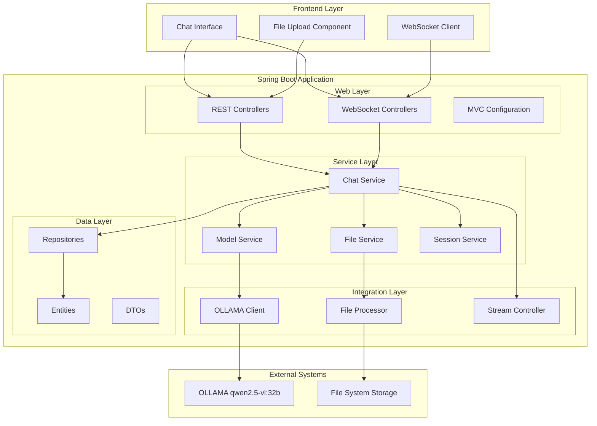
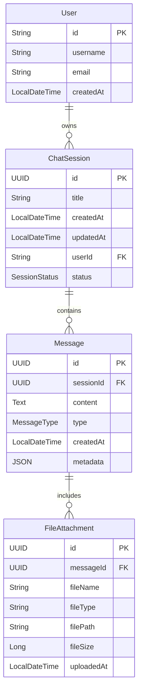
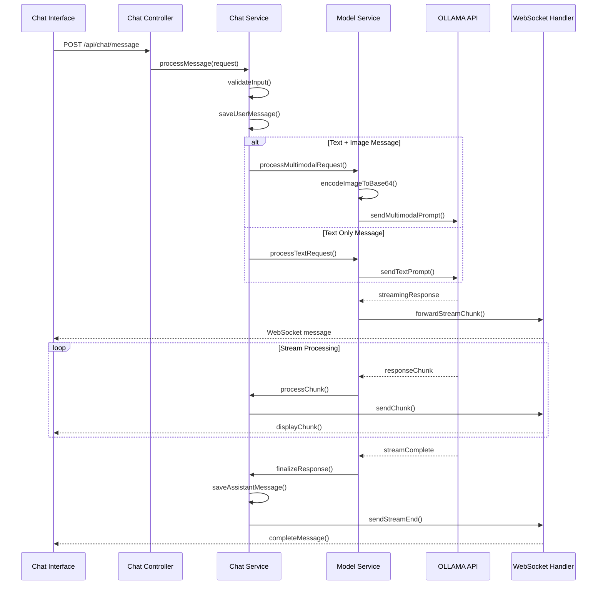
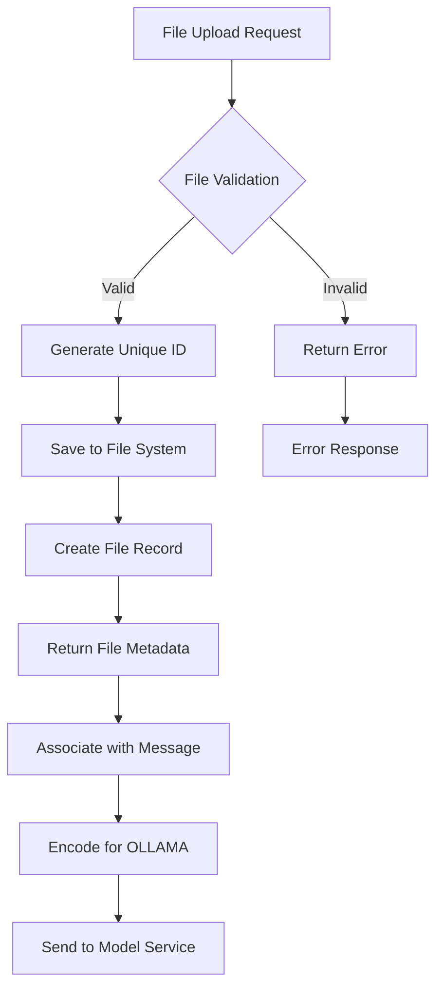

# AI Chat Service with OLLAMA Integration Design

## Overview

The AI Chat Service is a Spring Boot-based web application that provides an intelligent conversational interface powered by the locally deployed OLLAMA qwen2.5-vl:32b model. The service offers a modern, user-friendly chat experience with multimodal capabilities, supporting both text and image inputs with real-time streaming responses.

### Core Objectives
- Deliver a clean, modern chat interface similar to commercial AI platforms
- Support multimodal interactions (text + image inputs)
- Provide real-time streaming responses for enhanced user experience
- Maintain high modularity and extensibility for future enhancements
- Integrate seamlessly with local OLLAMA deployment

### Key Features
- **Multimodal Chat Interface**: Text and image input capabilities
- **Streaming Responses**: Real-time response delivery with typewriter effect
- **File Upload Management**: Secure image file handling and processing
- **Conversation History**: Session-based chat persistence
- **Responsive Design**: Mobile and desktop compatible interface
- **Modular Architecture**: Plugin-ready system for future AI model integrations

## Technology Stack & Dependencies

### Backend Framework
- **Spring Boot 3.x**: Core application framework
- **Spring Web**: REST API and web layer
- **Spring WebFlux**: Reactive streams for real-time communication
- **Spring Data JPA**: Data persistence layer
- **Spring Security**: Authentication and authorization
- **Spring Boot DevTools**: Development productivity

### Database & Storage
- **H2 Database**: Embedded database for development
- **PostgreSQL**: Production database option
- **Local File System**: Image storage with configurable paths

### Frontend Technologies
- **HTML5**: Semantic markup structure
- **CSS3**: Modern styling with CSS Grid and Flexbox
- **Vanilla JavaScript**: ES6+ features for interactive functionality
- **WebSocket/SSE**: Real-time communication for streaming

### Integration Libraries
- **Apache HTTP Client**: OLLAMA API communication
- **Jackson**: JSON processing and serialization
- **Multipart File Handling**: Spring's built-in file upload support

## Architecture

### System Architecture Overview



### Component Architecture

#### Frontend Components
| Component | Responsibility | Key Features |
|-----------|----------------|--------------|
| Chat Interface | Main user interaction area | Message display, input handling, responsive layout |
| Message Component | Individual message rendering | Text/image display, timestamp, streaming animation |
| Input Component | User input management | Text area, file upload, send controls |
| Upload Component | File handling interface | Drag-drop, preview, validation |
| Stream Handler | Real-time response processing | WebSocket/SSE management, message parsing |

#### Backend Services
| Service | Responsibility | Dependencies |
|---------|----------------|--------------|
| ChatService | Orchestrates conversation flow | ModelService, SessionService, FileService |
| ModelService | OLLAMA integration and communication | OLLAMAClient, StreamController |
| FileService | Image upload and processing | FileProcessor, StorageManager |
| SessionService | Conversation state management | Repository layer, DTOs |
| SecurityService | Authentication and authorization | Spring Security, User management |

## API Endpoints Reference

### Chat Management Endpoints

| Endpoint | Method | Purpose | Request Body | Response |
|----------|--------|---------|--------------|----------|
| `/api/chat/sessions` | GET | Retrieve user chat sessions | - | List of session summaries |
| `/api/chat/sessions` | POST | Create new chat session | `{title?: string}` | Session details |
| `/api/chat/sessions/{id}` | GET | Get specific session | - | Session with message history |
| `/api/chat/sessions/{id}` | DELETE | Delete chat session | - | Success status |

### Message Processing Endpoints

| Endpoint | Method | Purpose | Request Body | Response |
|----------|--------|---------|--------------|----------|
| `/api/chat/message` | POST | Send text message | `{sessionId: string, content: string}` | Message acknowledgment |
| `/api/chat/message/multimodal` | POST | Send text + image | `FormData: sessionId, content, file` | Message acknowledgment |
| `/api/chat/stream/{sessionId}` | GET | WebSocket/SSE stream | - | Streaming response |

### File Management Endpoints

| Endpoint | Method | Purpose | Request Body | Response |
|----------|--------|---------|--------------|----------|
| `/api/files/upload` | POST | Upload image file | `MultipartFile` | File metadata |
| `/api/files/{id}` | GET | Retrieve uploaded file | - | File content |
| `/api/files/{id}` | DELETE | Delete uploaded file | - | Success status |

### Authentication Requirements

| Endpoint Group | Authentication | Authorization |
|----------------|----------------|---------------|
| `/api/chat/*` | Session-based | User role |
| `/api/files/*` | Session-based | File ownership |
| `/ws/chat/*` | WebSocket auth | Session validation |

### Request/Response Schema

#### Chat Message Request
```json
{
  "sessionId": "string (UUID)",
  "content": "string (max 4000 chars)",
  "type": "text | multimodal",
  "metadata": {
    "timestamp": "ISO 8601",
    "clientId": "string"
  }
}
```

#### Streaming Response Format
```json
{
  "type": "stream_start | stream_chunk | stream_end | error",
  "sessionId": "string",
  "messageId": "string",
  "content": "string",
  "metadata": {
    "timestamp": "ISO 8601",
    "tokenCount": "number",
    "processingTime": "number"
  }
}
```

## Data Models & ORM Mapping

### Core Entities

#### ChatSession Entity
| Field | Type | Constraints | Description |
|-------|------|-------------|-------------|
| id | UUID | Primary Key | Unique session identifier |
| title | String(255) | Not null | User-defined or auto-generated title |
| createdAt | LocalDateTime | Not null | Session creation timestamp |
| updatedAt | LocalDateTime | Not null | Last activity timestamp |
| userId | String(100) | Foreign Key | Session owner identifier |
| status | Enum | Active/Archived | Session state |

#### Message Entity
| Field | Type | Constraints | Description |
|-------|------|-------------|-------------|
| id | UUID | Primary Key | Unique message identifier |
| sessionId | UUID | Foreign Key | Associated chat session |
| content | Text | Not null | Message text content |
| type | Enum | User/Assistant | Message sender type |
| createdAt | LocalDateTime | Not null | Message timestamp |
| metadata | JSON | Nullable | Additional message data |

#### FileAttachment Entity
| Field | Type | Constraints | Description |
|-------|------|-------------|-------------|
| id | UUID | Primary Key | Unique file identifier |
| messageId | UUID | Foreign Key | Associated message |
| fileName | String(255) | Not null | Original file name |
| fileType | String(50) | Not null | MIME type |
| filePath | String(500) | Not null | Storage location |
| fileSize | Long | Not null | File size in bytes |
| uploadedAt | LocalDateTime | Not null | Upload timestamp |

### Database Relationships



## Business Logic Layer

### Chat Flow Architecture

#### Message Processing Workflow



#### File Upload Processing



### Service Layer Design

#### ChatService Implementation Strategy
- **Session Management**: Handles CRUD operations for chat sessions
- **Message Orchestration**: Coordinates between user input and AI response
- **Stream Coordination**: Manages real-time response delivery
- **Error Handling**: Provides comprehensive error recovery and user feedback

#### ModelService Integration Pattern
- **Request Transformation**: Converts application requests to OLLAMA format
- **Response Processing**: Handles streaming responses and parsing
- **Connection Management**: Maintains stable connections to OLLAMA
- **Retry Logic**: Implements exponential backoff for failed requests

#### FileService Management
- **Upload Validation**: File type, size, and content validation
- **Storage Organization**: Hierarchical storage with cleanup policies
- **Image Processing**: Resizing and format optimization for model input
- **Security Scanning**: Basic security checks for uploaded content

## Middleware & Interceptors

### Security Middleware

| Component | Purpose | Implementation |
|-----------|---------|----------------|
| CORS Filter | Cross-origin request handling | Allow specific origins for WebSocket |
| Security Headers | XSS, CSRF protection | Standard Spring Security headers |
| File Upload Filter | Malicious file detection | MIME type validation, size limits |
| Rate Limiting | API abuse prevention | Token bucket algorithm |

### Logging & Monitoring

| Interceptor | Scope | Data Captured |
|-------------|-------|---------------|
| Request Logger | All API endpoints | Request/response times, payload sizes |
| Error Handler | Global exception handling | Stack traces, user context |
| Performance Monitor | Service layer | Method execution times, OLLAMA latency |
| WebSocket Logger | Real-time communications | Connection events, message flow |

### Configuration Management

| Component | Configuration Source | Purpose |
|-----------|---------------------|---------|
| OLLAMA Config | application.yml | API endpoint, timeout settings |
| File Storage Config | Environment variables | Storage paths, size limits |
| Security Config | Spring profiles | Authentication methods, CORS settings |
| Database Config | Profile-specific | Connection pooling, migration settings |

## Testing Strategy

### Unit Testing Approach

#### Service Layer Testing
- **Mock Dependencies**: OLLAMA client, file system, database
- **Business Logic Validation**: Message processing, session management
- **Error Scenario Testing**: Network failures, invalid inputs
- **Performance Testing**: Response time thresholds, memory usage

#### Integration Testing Scope

| Component | Test Focus | Tools |
|-----------|------------|-------|
| OLLAMA Integration | API communication, streaming responses | TestContainers, WireMock |
| Database Layer | Entity relationships, query performance | H2 in-memory, test data sets |
| File Upload | Multipart handling, storage operations | MockMVC, temporary files |
| WebSocket Communication | Real-time messaging, connection handling | WebSocket test client |

#### Frontend Testing Strategy

| Test Type | Coverage | Implementation |
|-----------|----------|----------------|
| Unit Tests | JavaScript functions, UI components | Jest, DOM testing utilities |
| Integration Tests | API communication, file uploads | Selenium WebDriver |
| End-to-End Tests | Complete user workflows | Playwright, Cypress |
| Performance Tests | Loading times, responsiveness | Lighthouse, WebPageTest |

### Test Data Management

#### Mock Data Strategy
- **Conversation Templates**: Pre-defined chat scenarios
- **Image Test Sets**: Various formats and sizes for upload testing
- **Response Mocking**: OLLAMA response simulation for consistent testing
- **Error Simulation**: Network timeouts, server errors, invalid responses

#### Test Environment Configuration
- **Isolated Database**: Separate test database with automated cleanup
- **Mock OLLAMA Server**: Controlled responses for predictable testing
- **File System Isolation**: Temporary directories for upload testing
- **Configuration Profiles**: Test-specific settings and feature flags